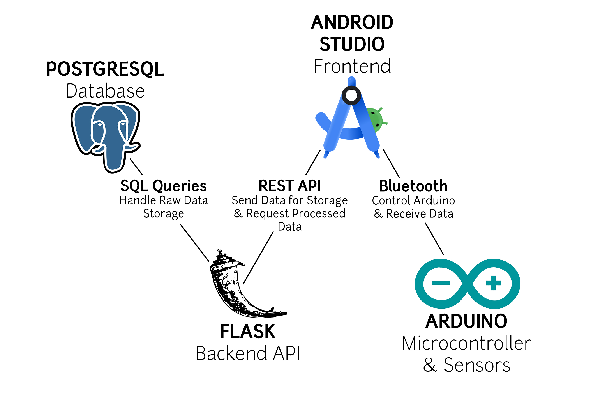

# Tensile Strength and Stress Tester
## Description of the project:
The Tensile Strength and Stress Tester is made up of a pressure sensor for compression strength measurement and an IR sensor for measuring the stretchability of the material. These sensors are mounted to a motorized clamp. The sensors as well as a motor moving the press are attached to an Android mobile application via Bluetooth allowing one to plot how much a material can be compressed or stretched. The app will have the possibility to store this data and plot multiple data sets, allowing easy comparison between the different tested materials. The device also has a temperature sensor since a material's strength is temperature-dependent. 

## Technology Used
* #### Android Studio
We're using Android Studio to develop our mobile app. The app will control the Arduino and receive data from it. We didn’t choose Android Studio ourselves, it was assigned to us as part of the project requirements.
* #### Arduino
We chose Arduino as our microcontroller platform because we all have experience with it from ENGR 290, and it’s a widely used, well-supported system with plenty of community resources.  
* #### Flask
Flask is our choice for the backend REST API because it’s lightweight, easy to use, and fits well with our needs. Plus, since it runs on Python, it gives us the flexibility to implement more advanced data analysis in the future if needed.
* #### PostgreSQL
We chose PostgreSQL because it’s a powerful, reliable, and scalable database. It supports complex queries, handles large datasets efficiently, and is well-suited for structured data storage.
* #### Azure Cloud 
Our PostgreSQL database will be hosted on Azure Cloud, mainly for two reasons. The first one is cost-effectivenese. We have free Azure credits through our school, so this is the most budget-friendly option. The second one is familiarity. Some team members have prior experience with Azure, making deployment and management easier.

## Team members and roles:
* #### Zachary Cohen
  - Program: Computer Engineering 
  - Username: Zatcheryy
* #### Tyler Kassis
  - Program: Computer Engineering 
  - Username: TylerLK
* #### Jason Manuele
  - Program: Computer Engineering 
  - Username: adjasontm
* #### Jessica Socher
  - Program: Electrical Engineering 
  - Username: lightbulbw
* #### Pascal Ypperciel 
  - Program: Computer Engineering 
  - Username: pascalypperciel