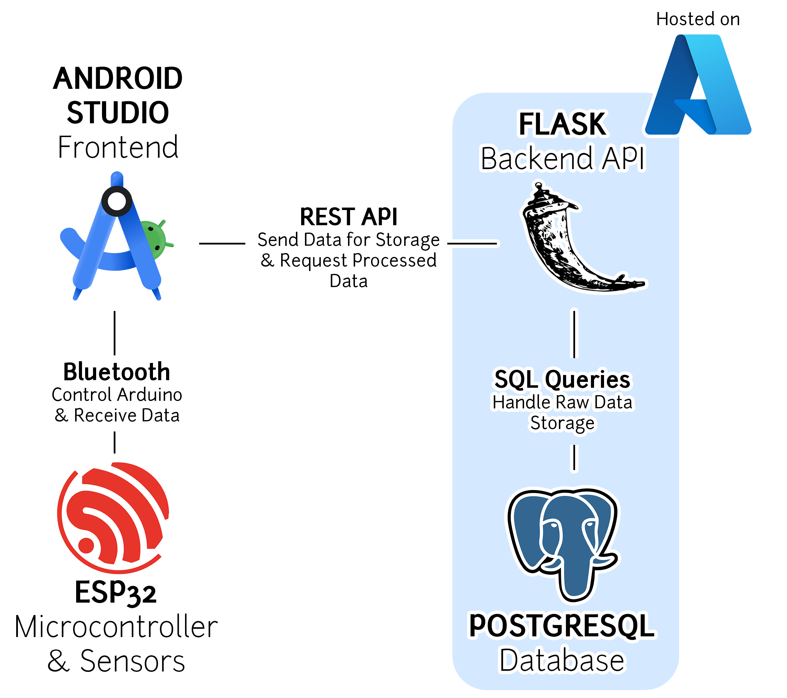

# Compression Analysis Tool (CAT)
## Description of the project:
The Compression Analysis Tool consists of a pressure sensor for measuring compression force and a rotary encoder to track screw rotation, allowing for the calculation of material displacement during compression. These sensors are mounted to a motorized clamp. The sensors as well as a motor moving the press are connected to an Android application via Bluetooth allowing one to further analyze the obtained data. The app will have the possibility to plot multiple data sets, allowing easy comparison between the different tested materials. The device also has a temperature sensor since a material's strength is temperature-dependent. 

## Technology Used
* #### Android Studio
We're using Android Studio to develop our mobile app. The app will control the Arduino and receive data from it. We didn’t choose Android Studio ourselves, it was assigned to us as part of the project requirements.
* #### ESP32
We chose the ESP32 as our microcontroller platform because we need the full Bluetooth capability (some boards only offer BLE) and it has enough digital pins for all of our sensors. Additionally, it has two cores, which allow us to implement multi-threading to handle data serialization and I/O. Also, it’s a widely used and well-supported system with plenty of community resources.  
* #### Flask
Flask is our choice for the backend REST API because it’s lightweight, easy to use, and fits well with our needs. Plus, since it runs on Python, it gives us the flexibility to implement more advanced data analysis.
* #### PostgreSQL
We chose PostgreSQL because it’s a powerful, reliable, and scalable database. It supports complex queries, handles large datasets efficiently, and is well-suited for structured data storage.
* #### Azure Cloud 
Our PostgreSQL database and Flask API will be hosted on Azure Cloud, mainly for two reasons. The first one is cost-effectivenese. We have free Azure credits through our school, so this is the most budget-friendly option. The second one is familiarity. Some team members have prior experience with Azure, making deployment and management easier.

## Team members and roles:
* #### Zachary Cohen
  - Program: Computer Engineering 
  - Username: Zatcheryy
* #### Tyler Kassis
  - Program: Computer Engineering 
  - Username: TylerLK
* #### Jason Manuele
  - Program: Computer Engineering 
  - Username: adjasontm
* #### Jessica Socher
  - Program: Electrical Engineering 
  - Username: lightbulbw
* #### Pascal Ypperciel 
  - Program: Computer Engineering 
  - Username: pascalypperciel
