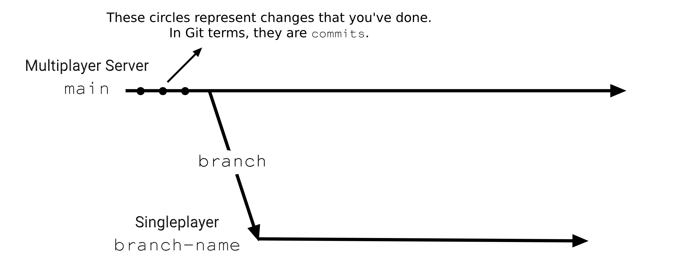
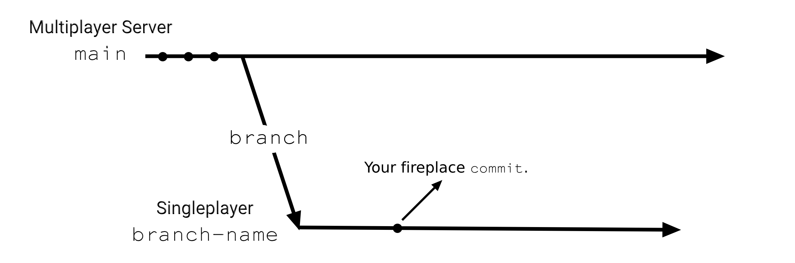
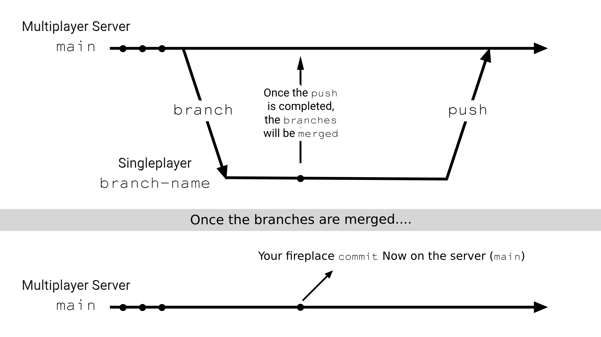
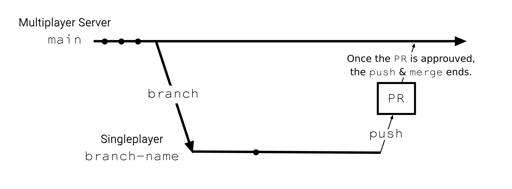

## GitHub Guide for Beginners

I decided to write this guide based on a video I once watched where someone explained Git using a Minecraft server analogy. This makes it easier to visualize the core concepts of Git and GitHub.

### Understanding Git with Minecraft

Imagine we're all playing on the same Minecraft server and we build a wooden house together. Some players want to add a fireplace inside the house, but others worry it might burn everything down.

To test the idea safely, you decide to make a **copy** of the world save from the server (this represents the `main` branch) and load it in singleplayer mode. This is called **branching** (`branch`), you create a separate copy of the world where you can make changes without affecting the main multiplayer server.

### Making Changes Safely

Now that you have your own copy of the world, you go ahead and build the fireplace. You test it thoroughly to make sure it doesn't set the whole house on fire. Once you're happy with your work and confident that the fireplace is safe, you take a snapshot of your progress. This is like making a `commit` in Git. A commit is a saved checkpoint of your work.

### Sharing Your Work

After testing, you decide it's time to share your improved version of the world with the rest of the server. To do this, you `push` your changes back to the server, just like uploading your singleplayer world back to the multiplayer server.

However, depending on the rules of the server, you might need approval first. Before merging your new fireplace into the main world, your friends may want to check your work to ensure everything looks good. This process is called a `Pull Request (PR)`. You ask others to review and approve your changes before they become part of the official world.

### Summary
- **Branching**: Copying the world save from the server to your singleplayer mode.
- **Commit**: Taking a snapshot of your progress after making changes.
- **Push**: Uploading your updated world back to the server.
- **Pull Request (PR)**: Asking for approval before merging your changes.

By Pascal Ypperciel