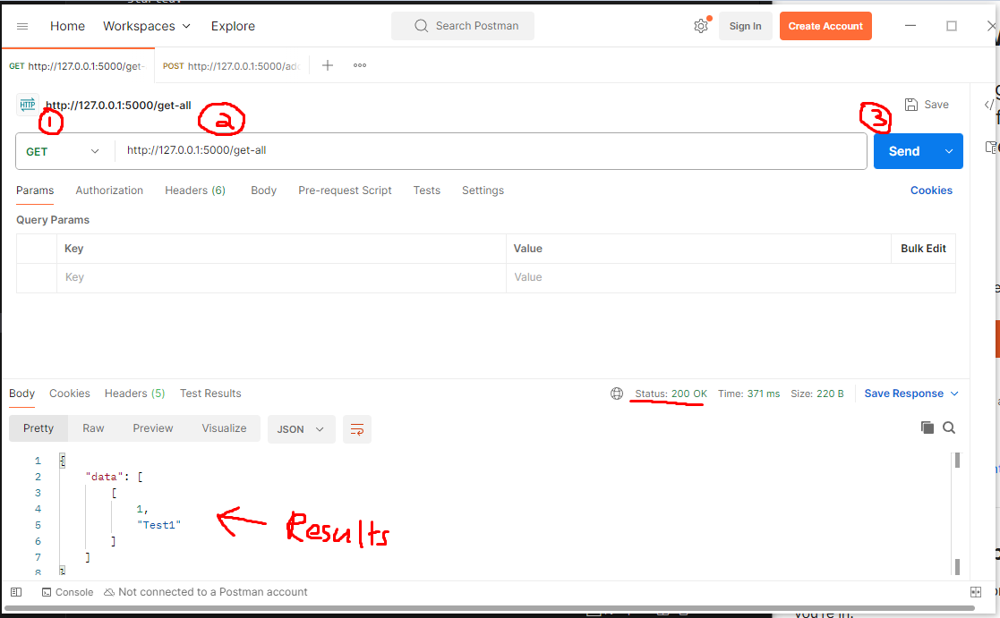
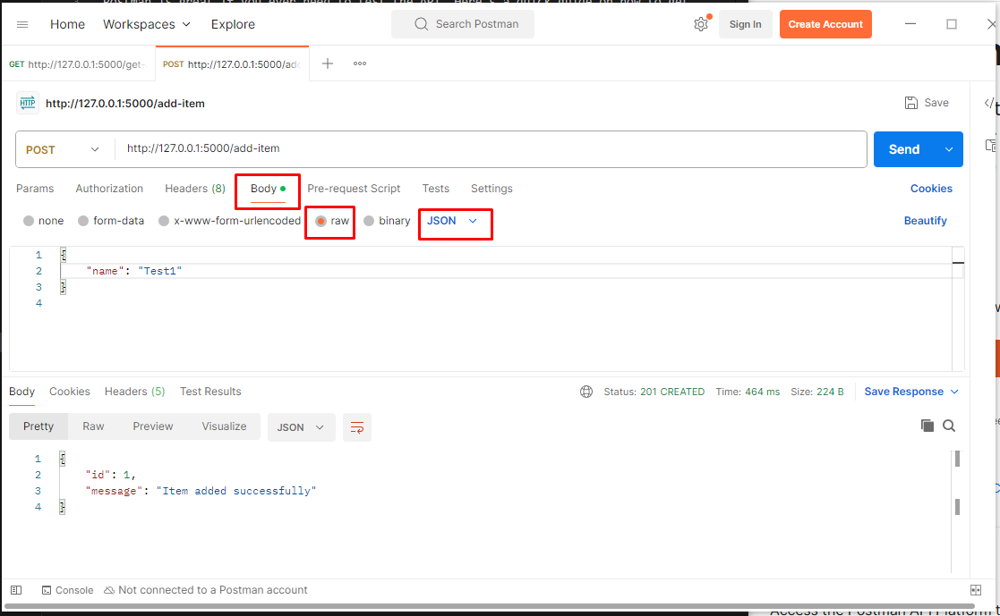

# Setting Up Postman

Postman is great if you ever need to test the API. Here's a quick guide on how to get started.

## 1️. Install Postman
Download and install **Postman** by following the official instructions here:  
[**Download Postman**](https://www.postman.com/downloads/)

 **Note**: You do not need to create an account when prompted.

## 2. How does it work?
So, assuming that your API (backend) is up and running, you may make requests to the testing routes that I've created.

Here's what you see in the picture above:
1. Select your request type. (GET, POST, PUT, etc.)
2. Enter the route URL, it should include the address, the port, and the right endpoint url.
3. Click **Send**.
4. Make sure you get the success/error code you expected, and you can see the results down below.

If you're testing a POST, PUT, or any other type of request that has a body, you can follow the instructions in the screenshot above.
1. Select **Body** in the row of options. 
2. Select **raw** and then **JSON**. (We will be using JSON with our API, which is standard).
3. Enter your body, in JSON format of course.
4. Click **Send** when ready.
